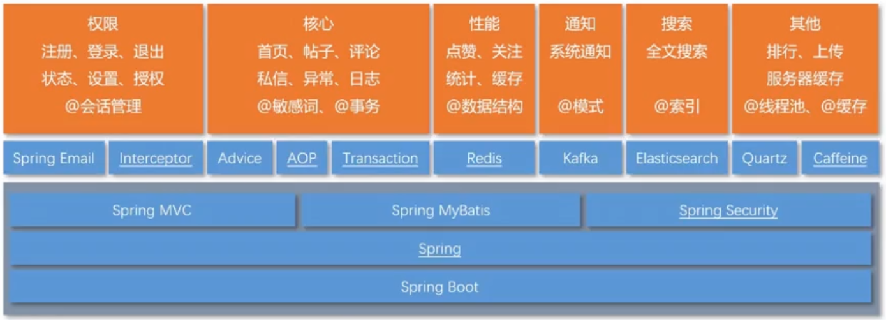

# 牛客论坛

[项目介绍](#项目介绍) | [技术架构](#技术架构) | [开发环境](#开发环境) | [项目总结](#项目总结) | [效果展示](#效果展示) | [参考资料](#参考资料)

ʕ•̫͡•ʔ-̫͡-ʕ•͓͡•ʕ•̫͡•ʔ-̫͡-ʕ•͓͡•ʔ-̫͡-ʔ

## 项目介绍

一个仿牛客网实现的讨论社区，不仅实现了基本的注册，登录，发帖，评论，点赞，回复功能，同时使用前缀树实现敏感词过滤，使用wkhtmltopdf生成长图和pdf，实现了网站UV和DAU统计，并将用户头像等信息存于七牛云服务器。    

## 技术架构

- Spring Boot
- Spring 、Spring MVC、MyBatis
- Redis、Kafka、Elasticsearch
- Spring Security、Spring Actuator

## 开发环境

- 构建工具：Apache Maven
- 集成开发工具：IDEA
- 数据库：MySQL、Redis
- 应用服务器：Apache Tomcat
- 版本控制工具：Git

## 项目功能
##### 已完成部分

- index界面，分页查询功能
  - 
- 注册
  - 

- 登录、退出功能
  - 登录：验证账号、密码、验证码；返回给浏览器
    - 成功：生成登录凭证返回给客户端；
    - 失败：保留表单信息跳转回登录页；
  - 退出：将登录状态转换为失效，用户跳转到首页；
- 显示登录信息
  - 利用拦截器实现
  - 在请求之后，响应之前，preHandle检查是否有token，通过token查询是否有用户信息，postHandle将用户信息添加到线程池中进行线程隔离，model从线程池中进行获取，模版引擎获取model中数据进行渲染；
- 检查登录状态（权限控制）
  - 使用自定义注解
    - @Target 指定注解可以存在的位置
    - @Retention(RetentionPolicy.RUNTIME) 编译时有效/ 运行时有效 /编译时丢弃
    - @Documented 在生成文档时，是否要携带该注解
    - @Inherited 继承父类时使用
  - 利用反射获取注解类型，如果注解非空，重定向到登录界面
- 敏感词过滤
  - 利用前缀树实现（trie、字典树）
    - 查找效率高、占用内存大；
    - 使用map进行存储

1. 定义一颗trie树
2. 将敏感词利用反射读取字节流，初始化一颗前缀树
3. 过滤敏感词算法

- 日志
  - 配置logback-spring.xml，对error、info、debug日志分别进行配置储存；
- 账号设置
  - 上传头像
  - 修改密码
- 发布帖子
  - 实现service add接口，使用敏感词对帖子标题和内容进行过滤；
- 

##### 待完成

- es
- mq
- 消息机制
- redis

## 项目总结

- 使用Spring Security 做权限控制，替代拦截器的拦截控制，并使用自己的认证方案替代Security 认证流程，使权限认证和控制更加方便灵活。
- 使用Redis的set实现点赞，zset实现关注，并使用Redis存储登录ticket和验证码，解决分布式session问题。
- 使用Redis高级数据类型HyperLogLog统计UV(Unique Visitor),使用Bitmap统计DAU(Daily Active User)。
- 使用Kafka处理发送评论、点赞和关注等系统通知，并使用事件进行封装，构建了强大的异步消息系统。
- 使用Elasticsearch做全局搜索，并通过事件封装，增加关键词高亮显示等功能。
- 对热帖排行模块，使用分布式缓存Redis和本地缓存Caffeine作为多级缓存，避免了缓存雪崩，将QPS提升了20倍(10-200)，大大提升了网站访问速度。并使用Quartz定时更新热帖排行。
- 使用 `Jasypt` 实现配置文件敏感信息加密。

## 效果展示
待上线

## 参考资料

[https://github.com/cosen1024/community](